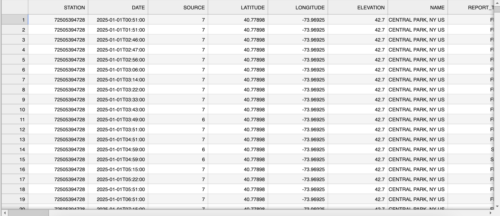

# Data Parsing

This document discusses the methods I use to parse data, and how I arrived to those methods.

https://www.ncei.noaa.gov/maps/hourly/

The link above leads to a portal that NOAA uses to share with the public hourly observational data 
for weather stations across around the country. This is where I get all the data to trade my model
from.

Once you've downloaded the data, you'll see something like this.

This data is in the format of a .csv file. Let's go through each column and explain what each one is.

## Column Breakdown

Below is a table of each column in the hourly CSV extract and how I interpret & parse it. All character‐positions refer back to the NOAA ISD spec (see _isd-format-document.pdf_).

| Column       | Byte Positions (Fixed-Width) | Description                                              | Raw Format / Units                  | Parsing Notes                                                     |
|--------------|-------------------------------|----------------------------------------------------------|-------------------------------------|-------------------------------------------------------------------|
| **STATION**  | 5–10 (USAF) & 11–15 (WBAN)    | Unique station identifier                                | Integer (e.g. `72505394728`)        | Read as string; keeps leading zeros, then split into USAF/WBAN.   |
| **DATE**     | 16–23 (YYYYMMDD)              | Observation date                                         | `20250101`                          | `pd.to_datetime(..., format="%Y%m%d")`                            |
| **TIME**     | 24–27 (HHMM)                  | UTC time of observation                                  | `0033` → 00:33                       | Combine with DATE into a `datetime64[ns]` column.                 |
| **SOURCE**   | 28                            | Reporting flag                                           | Integer code                        | Map codes (7 = “Automated Station”) per spec.                     |
| **LATITUDE** | 29–34                         | Station latitude                                         | In thousandths of degrees           | Divide by 1 000 → float degrees (e.g. `40778` → 40.778°).          |
| **LONGITUDE**| 35–41                         | Station longitude                                        | In thousandths of degrees           | Divide by 1 000 → float degrees (e.g. `-73969` → -73.969°).        |
| **ELEVATION**| 47–51                         | Station elevation                                        | Meters                              | Float; missing code `9999` → `NaN`.                               |
| **NAME**     | 52–56                         | Station name / call letters                              | String                              | Strip trailing spaces.                                            |
| **REPORT_TYPE** | 57–60                      | Quality-control / report type flag                       | String code (e.g. `FM–12`)          | Leave as categorical.                                             |

---

### Mandatory Weather Elements (columns 61–105)

These columns contain the actual meteorological measurements:

| Field            | Bytes   | Description                   | Raw Units        | Parsing / Conversion                                      |
|------------------|---------|-------------------------------|------------------|-----------------------------------------------------------|
| Wind Direction   | 61–63   | Wind direction                | Degrees (°)      | `int`; `999` = missing → set to `NaN`                     |
| Wind Speed       | 64–66   | Wind speed                    | Tenths of m/s    | Divide by 10 → m/s; `999` = missing                       |
| Visibility       | 67–69   | Visibility                    | Statute miles    | `int`; `999` = missing; convert to km if desired          |
| Temperature      | 100–104 | Air temperature               | Tenths of °C     | Divide by 10 → °C; `9999` = missing                       |
| Dew Point        | 105–109 | Dew point                     | Tenths of °C     | Divide by 10 → °C; `9999` = missing                       |
| Sea Level Press. | 111–116 | Sea level pressure            | Tenths of hPa    | Divide by 10 → hPa; `99999` = missing                     |

*(The above is a subset—see pages 8–10 of the spec for the full list.)*

**Note**
The source for this data formatting can be found in the file isd-format-document.pdf on 
pages 5–7 (Control Data Section), 8–12 (Mandatory Weather Elements), and 13+ (Additional Data Sections).

These page numbers follow both the numbers as listed in the PDF itself and also the absolute numbers
as listed by your PDF reader.

&nbsp;

## Feature Engineering
Of course, not all of this data is useful. In fact, most of it isn't.

For the purposes of this project, we only keep a handful of the original 91 columns of data and
use the remaining data to engineer a few more unique features. Let's walk through each of them below.

