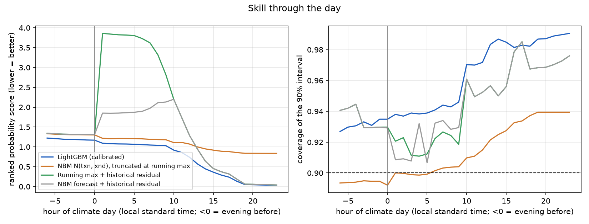
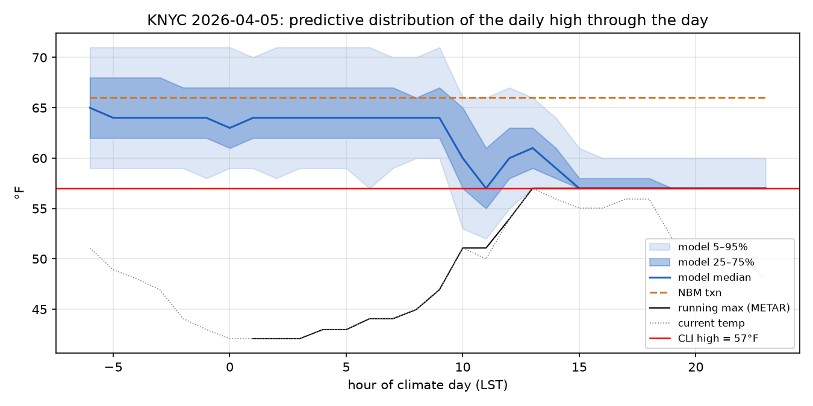
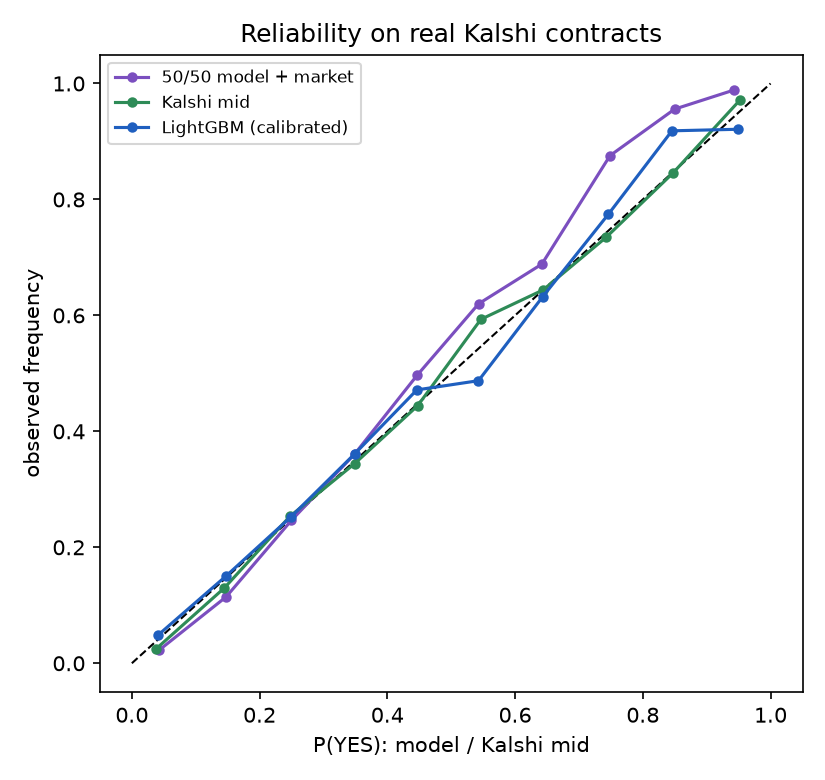

# weather-bot: calibrated daily-high forecasts for Kalshi weather markets

[](https://github.com/SomeGuy966/weather-bot/actions/workflows/ci.yml)


`weatherbot` turns the information available at any hour of the day — the METARs received so far, the latest NBM and GFS MOS guidance, yesterday's climate report — into a **full probability distribution over the day's official high temperature** for the eight U.S. cities with Kalshi daily-high markets, maps that distribution onto every open contract, and asks the question the project was started to answer: *are these markets mispriced?*

The answer, on two months of archived Kalshi prices, is **no**. The model beats the NBM's own guidance by a wide margin and is almost perfectly calibrated, but the market is sharper than the model at every hour and in every city, and a simple edge-taking rule loses money after fees. The 2025 hypothesis that started this repo — that retail-dominated weather markets are inefficient — did not survive contact with a rigorous test in 2026.

## Headline findings

1. **A LightGBM model on METAR + NBM features beats the NBM's own probabilistic guidance by 30 %** on the held-out period (Jul 2025 → Sep 2026, 438 station-days, 105k hourly snapshots): log-loss 1.49 vs 2.12, ranked probability score 0.76 vs 1.10. Contract-level expected calibration error is 0.004. The gain comes from learning how the running maximum converges through the day: by mid-afternoon the model's RPS is a third of the NBM's.
2. **The market is better still.** On 52k contract-hours with a two-sided book (Jul 7 → Sep 11, 2026), Kalshi's mid-price scores Brier 0.120 to the model's 0.141. Both are calibrated (reliability curves below); the market has more resolution, and the gap is widest in the late afternoon on contested contracts, where participants evidently have sub-hourly observations the METAR feed doesn't carry.
3. **Trading the disagreement loses money.** Buying whichever side the model prices ≥ 5 ¢ better than the book, after Kalshi's 7 % taker fee, returned −$0.024 per contract over 2,177 signals (95 % bootstrap CI on the total: [−94, −13] dollars). Raising the margin to 10 ¢ trims the loss to statistically zero, not to a profit.
4. **Settlement mechanics matter more than modelling.** Kalshi settles on the NWS Daily Climate Report (CLI) republished by The Weather Company, over the local *standard* time day, in whole °F from 2-minute averages. The METAR temperature is a 0.1 °C instantaneous reading: the CLI high equals the METAR-derived maximum on 97.2 % of the 19,549 station-days here, exceeds it on 2.4 %, and comes in *below* it on 0.5 % — sensor failures that NWS quality-controls out (KNYC read 68 °F for two hours on 2024-12-29; the CLI said 60). That last half-percent is where the original 2025 version of this project lost its money.

<p align="center"></p>

*Left: skill through the day. The model tracks the NBM-plus-history baseline the evening before and pulls away once observations arrive; "running max + historical residual" is the rule of thumb a careful human uses in-day. Right: the model's 90 % interval covers ≥ 93 % at every hour (discrete intervals are conservative by construction).*

<p align="center"></p>

*A 9 °F NBM bust at Central Park. The model's median moves off the forecast as soon as the morning warm-up stalls and collapses onto the observed running maximum by mid-afternoon.*

<p align="center"></p>

*Reliability on real contracts: both the model and the Kalshi mid sit on the diagonal — the market is not miscalibrated, it is better informed.*

## Results

### Whole-distribution scores, test period (Jul 2025 → Sep 2026)

All forecasters are scored on the same integer-degree grid. `nbm` is NBM's day-max forecast with its published spread, discretised and truncated below the running max once the day has started; `persistence` is the running max plus the training-set distribution of how much further the day went from that hour; `residual_hist` is the NBM forecast plus its historical error distribution. Full tables in [`results/summary.md`](results/summary.md).

| forecaster | log-loss | RPS | Brier | MAE (median) | exact hit | 50 % cov. | 90 % cov. |
| :-- | --: | --: | --: | --: | --: | --: | --: |
| **LightGBM (calibrated)** | **1.492** | **0.756** | **0.627** | **1.05** | **0.443** | 0.765 | 0.958 |
| NBM N(txn, xnd), truncated | 2.116 | 1.100 | 0.853 | 1.51 | 0.244 | 0.657 | 0.913 |
| Running max + history | 2.029 | 1.677 | 0.722 | 2.38 | 0.345 | 0.734 | 0.944 |
| NBM + history | 1.814 | 1.169 | 0.689 | 1.60 | 0.371 | 0.719 | 0.945 |

### Contract-level calibration (synthetic Kalshi ladder on every test day)

| forecaster | Brier | log-loss | ECE |
| :-- | --: | --: | --: |
| **LightGBM (calibrated)** | **0.081** | **0.258** | **0.004** |
| NBM N(txn, xnd), truncated | 0.111 | 0.358 | 0.034 |
| Running max + history | 0.114 | 0.370 | 0.055 |
| NBM + history | 0.101 | 0.324 | 0.026 |

### Against real Kalshi prices (Jul 7 → Sep 11, 2026; 3,216 contracts, 52,412 tradeable contract-hours)

| forecaster | Brier | log-loss |
| :-- | --: | --: |
| LightGBM (calibrated) | 0.141 | 0.434 |
| **Kalshi mid** | **0.120** | **0.372** |
| 50/50 blend | 0.125 | 0.387 |

| Brier ratio model / market | evening before | 00–06 LST | 06–12 | 12–15 | 15–18 | 18–24 |
| :-- | --: | --: | --: | --: | --: | --: |
| | 1.15 | 1.14 | 1.16 | 1.30 | 2.51 | 5.9 (n = 86) |

| edge margin | trades | hit rate | P&L / contract | 95 % CI on total |
| --: | --: | --: | --: | :--: |
| 2 ¢ | 2,410 | 0.389 | −$0.028 | [−110, −27] |
| 5 ¢ | 2,177 | 0.382 | −$0.024 | [−94, −13] |
| 10 ¢ | 1,839 | 0.378 | −$0.008 | [−56, +24] |

One contract per signal, first signal per contract-day, held to settlement, Kalshi taker fee `ceil(0.07·p·(1−p))`. Details in [`results/backtest_summary.md`](results/backtest_summary.md); the simulated trades are in `results/backtest_trades_m*.csv`.

## How it works

```
IEM json/cli.py ─────────► CLI daily high (label = Kalshi settlement)
IEM asos.py (METARs) ────► running max, 6-hourly checkpoints, current conditions, tendencies
IEM mos.py (NBM, GFS) ───► day-max forecast + spread, 3-hourly curve, remaining max
                                │
                     snapshot at hour h ──► LightGBM (31 classes of high − anchor)
                                │                       │ temperature scaling
                                ▼                       ▼
                    Kalshi contract ranges ◄── integer-degree PMF ──► P(YES) per contract
```

**Snapshots.** One row per (station, climate day, hour) for 30 hours from 18:00 LST the evening before through 23:00 LST, built with as-of joins so a row only ever sees METARs received and bulletins published before its timestamp (`weatherbot/features.py`; the availability lags are explicit constants, tested in `tests/test_features.py`).

**Target.** The classifier predicts `high − anchor` on `[−15, +15]`. The anchor is the NBM day-max forecast until the running maximum comes within 8 °F of it (or from 10:00 LST), then the running maximum itself — so "the high is already in" is class 0, and the distribution collapses cleanly in the evening even on days the forecast busted. A single softmax temperature is fitted on the calibration split (it comes out at 1.02: the booster is already calibrated).

**Contracts.** Kalshi's ladder is parsed from the market's subtitle and cross-checked against its strikes (`weatherbot/contracts.py`): `79° to 80°` is {79, 80}, `87° or above` is {87, …}. A contract's probability is a partial sum of the PMF; open-ended contracts beyond the grid get the pooled tail mass.

**Splits.** Train 2020-01-01 → 2024-12-31 (438k rows), calibration / early-stopping H1 2025 (43k), test 2025-07-01 → 2026-09-11 (105k). Strictly chronological.

**Live.** `weatherbot live` runs the same feature code on the last 36 hours of METARs and the last two days of bulletins (IEM is as current as the NWS API; `api.weather.gov` is the fallback), fetches the open Kalshi markets, and prints model vs book with the after-fee edge for every contract. `--paper` records one hypothetical entry per contract-day; `settle_paper()` scores them against Kalshi's results. Nothing places real orders.

### Settlement details that had to be verified

| question | answer | how it was verified |
| :-- | :-- | :-- |
| What does Kalshi settle on? | The NWS CLI high for the named station (`CLINYC`…), republished by The Weather Company; first published value, no restatement | market `rules_primary`; weather.com/kalshi "Daily Climate" page |
| Which day? | The local **standard** time calendar day, no DST | market close times are 05Z NYC / 06Z CHI / 07Z DEN / 08Z LAX — midnight LST |
| Is the IEM CLI archive the same number? | Yes, 8/8 stations matched TWC's published values for 2026-09-11 | `docs/data_sources.md` |
| Why not 1-minute ASOS data? | IEM's 1-minute archive arrives 12–36 h late and isn't 2-minute averaged, so it can't be a live feature | Herzmann, *Wagering on ASOS Temperatures* (IEM news #1469) |

## Reproduce

```bash
git clone https://github.com/SomeGuy966/weather-bot && cd weather-bot
python3.12 -m venv .venv && source .venv/bin/activate
pip install -e ".[dev]"        # macOS: brew install libomp first (LightGBM)
make run                       # fetch (~5 min, ~60 MB) → build → train (~2 min) → evaluate → backtest
```

Individual stages: `weatherbot fetch | build | train | evaluate | kalshi | backtest | live`. The Kalshi archive is append-only and the API only keeps recent markets, so `weatherbot kalshi` should run daily (a cron line is enough) to grow the backtest window. No API keys are needed for anything in this repository.

```bash
weatherbot live --station KNYC          # current model vs book for the open NYC contracts
weatherbot live --paper --loop 900      # every 15 min, all cities, log paper entries
```

## Repository layout

```
src/weatherbot/
  config.py        stations, Kalshi series, LST offsets, residual range, paths
  data/iem.py      CLI / METAR / MOS downloaders with a per-station-year Parquet cache
  data/kalshi.py   read-only Kalshi client + append-only archive (markets, candles, trades)
  metar.py         T-group, 6-hourly and 24-hour temperature groups from raw METARs
  features.py      snapshot table with as-of joins; the anchor logic; live snapshot frames
  model.py         LightGBM multiclass + temperature scaling; save/load
  contracts.py     Kalshi ladder parsing and PMF → contract probability
  evaluate.py      proper scores, baselines, reliability, figures, results/summary.md
  backtest.py      contract-hours vs archived books; information scores; P&L rule
  live.py          real-time inference, paper ledger
tests/             METAR parser, contract mapping, feature builder (leakage guards)
results/, figures/ committed outputs of the run described above
docs/              data-source notes, the original 2025 market-inefficiency thesis, journal
```

## Limitations and what would move the needle

- **Two months of prices.** Kalshi's API only exposes markets since the July 2026 series migration; the earlier `HIGHNY`-generation markets are gone. The market comparison is a summer-only sample, and the bootstrap CIs are wide. The archiver exists so that the next version of this table can cover a year.
- **The market has data the model doesn't.** The late-afternoon gap is consistent with participants watching sub-hourly observations in whole °F and knowing about sensor issues (KNYC's CLI came in 4 °F *below* its METAR maximum on 2026-08-27 and the book knew before the METARs did). Closing that gap needs a better observation feed, not a better classifier.
- **One forecast source.** NBM (and GFS MOS as a fallback) is what IEM archives back to 2019. Adding HRRR/ECMWF point forecasts, or several NBM cycles per day as trend features, is the obvious next modelling step; the hyperparameter surface is flat, the feature set is not.
- **Taker-only execution.** Posting maker orders at the model's price would remove the 7 % fee and half the spread; the backtest doesn't model queue position, so it stays conservative.
- **No position sizing or risk model.** One contract per signal is a measurement, not a strategy.

The market-inefficiency argument this repo began with is kept, unedited, in [`docs/inefficient_market_hypothesis.md`](docs/inefficient_market_hypothesis.md); it is a fair record of what the markets looked like from the outside in June 2025, and of why an honest backtest was needed.
