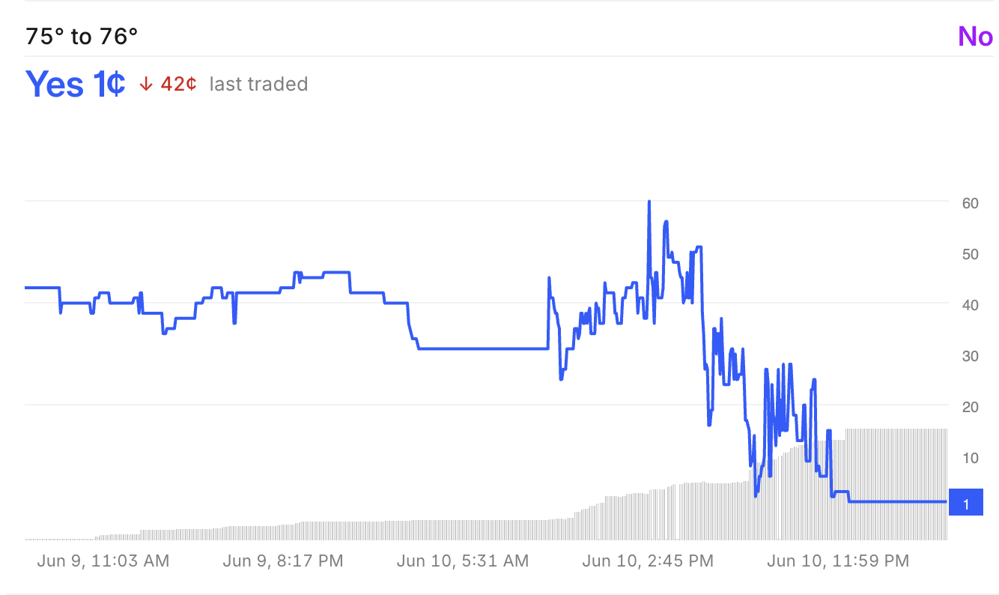

# Weather Markets are Inefficient

## Contents
- [Backstory](#backstory-not-necessary-to-read)
- [Tragedy on the First Day](#tragedy-on-the-first-day-of-trading)
- [Lessons Learned](#lessons-learned)
- [Inefficient Market Hypothesis](#inefficient-market-hypothesis)

## Backstory (not necessary to read)

### Tragedy on the First Day of Trading
Ok, so I first stumbled upon Kalshi's daily high temperature predictive markets sometime in December 2024.
I was back from Northwestern for winter break and I was really bored so I was looking for some things
to do. That's when I found the weather markets.

I thought that it'd be trivially easy to make money off the weather. After all, aren't government
weather models some of the best in the world? Surely I could just buy derivatives based off government
predictions and print money. Boy oh boy was I wrong.

On my first day of weather trading, I bought contracts for a certain high temperature bucket because
I was looking at the official weather observations and noticed that the temperature hadn't surpassed
a certain point yet. I think I bought about $100 worth of contracts.

But at 4:00 pm that day, when the recorded high temp up until that point came out, the high
temperature had indeed passed it. The gap in my reasoning was that the weather observations were
only hourly and didn't account for weather fluctuations between those hourly readings.

The value of my contracts plummeted to almost nothing. I think I cashed out for like $1 or something.

But I still had $100 left in my account. At this point it was already like 10:00 pm, so I thought
the daily high temp for that day had already passed. I noticed there were a few buckets open, so I
bought the "No" side of the contract for a temp bucket with implied odds of 97%.

Later that night, a storm moved in which caused the temperature to rise another two degrees. So again,
the value of my contracts plummeted.

The high temp for that day ended up hitting at exactly 11:59 pm.

That's how I lost $200 on my first day of trading weather derivatives.

&nbsp; <!-- space character for markdown -->

### Tragedy (Part 2)

Then, in January 2025, I bought $25 worth of contracts for the Denver weather market at implied
odds of 74% at around 11:00 am. Later that day, the value of the contracts spiked up to implied odds
of 98%.

I decided to hold my contracts because I thought it was practically guaranteed that I would they would
hit. Of course, just my luck they didn't end up hitting. The value of my contracts plummeted and I didn't
sell. I ended up losing everything.

&nbsp; 

### Lessons Learned
Although both of these instances hurt a lot, they gave me a lot of hard-learned lessons. First of all,
if the market is saying something but you've come to a different conclusion, you always need to 
triple-, quintuple check to make sure that you're right. Because there definitely could be something
you're just entirely missing.

But the most important lesson that I learned from this experience wasn't this -- it was that the markets
were incredibly inefficient.

If the markets were truly efficient, then the probability of both of my contracts not hitting given
the implied odds of the markets would be (1.00 - 0.97) * (1.00 - 0.98) = 0.06%.

Surely my luck couldn't be that bad. I think the issue is with market pricing. So from that point on,
I was determined to somehow exploit market inefficiences in the Kalshi weather derivaties markets.

So here I am, six months later, having learned much more and developed a lot of strong skills (including
work ethic), I think I'm prepared to finally conquer this market. 

Here we go!

&nbsp; 

## Inefficient Market Hypothesis
The fact that both of my bets didn't hit got me thinking, these markets _have_ to be ineffficient.

Due to this, I've conclulded that the Kalshi weather markets remain inefficient for several key 
reasons. 

**First**, the order flow is dominated by retail traders—individuals who often overreact to hourly 
temperature readings rather than relying on systematic, model-driven strategies. 
With few sophisticated market-making bots participating, mispricings tend to persist for extended 
periods.

**Second**, liquidity is thin and bid-ask spreads are wide. For example, the Los Angeles weather 
market has only been open since January 5, 2025. As of June 6th, 2025, its total volume traded over 
the course of the past 158 days is currently at \$7,400,750. This gives us an average daily trading 
volume of about \$47,093.35 per day.

Thus, each city’s market sees somewhere around \$45K–\$55K in daily volume, meaning that trades of 
just a few thousand dollars can move prices dramatically. In a deep market, these spikes and collapses
would be smoothed out, but here they happen unchecked, as demonstrated by contracts briefly trading at
98¢ before collapsing to 0¢.

**Third**, it is precisely because of these low daily volumes that large, disciplined institutional
traders don't bother to trade on these markets.

With an average daily trading volume of just \$45–55 K, each weather market on Kalshi 
remains too illiquid for most institutional participants. Large orders would suffer significant 
slippage and wide bid–ask spreads, making execution costly and eroding any potential model edge. 
Institutions require high-liquidity venues to meet strict risk-management and compliance standards, 
so they’re unlikely to commit capital until volumes grow substantially.

**Fourth**, behavioral overreactions to live data exacerbate volatility. When traders see significant 
changes in 5-minute or hourly temperature readings, they rush in or out of positions, pushing contract
prices to extremes—often as high as 90–98% implied probability—even when the true chance of an outcome
is far lower. These panics frequently reverse well before settlement, creating exploitable 
inefficiency.

**Fifth**, very few participants —retail or automated— model implied volatility or build a volatility 
surface. Without a volatility-aware pricing framework, convexity mispricings abound and opportunities
to trade premium on variance remain unexploited. Moreover, we can observe _significant_ volatility in 
these markets-- probably due to the illiquidity and retail-dominated nature of these exchanges. For
example, let's take a look at NYC's weather exchange for yesterday, June 10th.

This was the market for a contract 1 degree below the
forecastd high. As you can see, there are huge spikes and dips everywhere. A truly efficient market
would have a smooth curve that indicates the implied volatility changes gradually over time as more
and more information slowly comes out.

**Finally**, persistent price dislocations illustrate these inefficiencies in action. Anecdotal 
examples—like Denver contracts trading at 98¢ and expiring worthless—show that contract prices often
diverge wildly from realized outcomes, and that these mispricings last long enough for a disciplined,
volatility-focused strategy to detect and exploit them.

